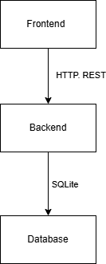

# Описание системы
Система состоит из 3 компонентов:
* Frontend - Node.js (Vue) (исходный код [bronyka-frontend](https://github.com/egormuhaev/bronyka-frontend))
* Backend - Python (FastAPI), реализует REST-full интерфейс поверх HTTP  (исходный код [bronyka-backend](https://github.com/ProfessorZel/bronyka-backend))
* Database - sqlite, минималистичная база данных представленная в виде файла



# Подготовка к развертыванию
Установить следующие продукты:
* [Docker Desktop](https://www.docker.com/products/docker-desktop/) - служба контейнеризации

# Сборка проекта
Для сборки проекта необходимо выполнить команду в корне проекта (рядом с docker-compose.yml), это создаст контейнер на основании [Dockerfile](./project/Dockerfile)
```shell
docker build .\project\
```
При выполнении этой команды: 
* создаст python:3.11-slim-buster - контейнер для сборки проекта
* установит зависимости из файла [requirements.txt](./project/requirements.txt)
* установит команду запуска

# Запуск проекта
Docker использует [docker-compose.yml](./docker-compose.yml) для запуска проекта, для этого необходимо:<br>
Сформировать файл `.env` и разместить его в корне проекта (рядом с docker-compose.yml)
```
# секрет для подписания JWT, случайны набор букв и цифир
SECRET_KEY=SECRET1 
# почта первого администратора
FIRST_SUPERUSER_EMAIL=admin@email.com
# пароль первого администратора, случайны набор букв и цифр
FIRST_SUPERUSER_PASSWORD=<>
# внешний, публичный порт
PUBLIC_PORT=8000
# пути сохранения БД
# ./data - относительный путь, по отношению к docker-compose.yml
DATA_FOLDER=./data
# через сколько времени редактирование доступно только администратору
DENY_CANCEL_AFTER_MINUTES_USED=5
# время жизни сессии пользователя в секундах
AUTH_TOKEN_LIFETIME_SECONDS=86400
# временная зона сервера
TZ=Europe/Moscow
```
Для запуска необходимо выполнить команду:
```shell
docker-compose up
```
При выполнении этой команды: 
* выполнит сборку, если не была выполнена
* подготовит окружение и параметры, и запустит контейнер, опубликую его на порту `PUBLIC_PORT`
